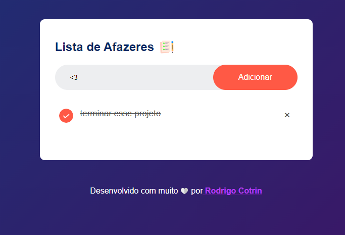

# todoListJavascript

## Sobre esse projeto 💡

Projeto independente desenvolvido em python com intuito de aprender mais eventos no javascript

<a href="https://listadeafazerescotrin.vercel.app" target="_blank">Link do projeto</a>

#### <strong>Status: </strong>Concluído ✔️

# Tecnologias utilizadas 💻

- [X] HTML
- [X] CSS
- [X] JAVASCRIPT

# Comentários Finais 🎂

Esse projeto foi bom para o meu aprendizado em javascript, nele aprendi muito sobre o uso de eventos e de funções no javascript, sempre pensando na construção de uma interface intuitiva.

# Autor

- Github - [@RodrigoCotrin](https://github.com/RodrigoCotrin/)
- Linkedin - [@RodrigoCotrin](https://www.linkedin.com/in/rodrigocotrin/)

***
[MIT LICENSE](https://github.com/RodrigoCotrin/todoListJavascript/blob/main/LICENSE)
